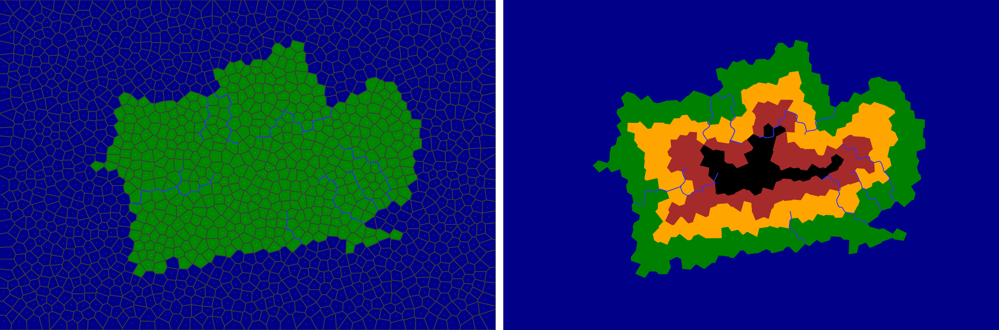

# Civilka-JS 

## Description

Landmass generation on Voronoi diagram in JavaScript.

You can open the online version by [clicking here](https://kasperado.github.io/Civilka-JS/).

## Installation

You don't need to install anything, simply open index.html after downloading the repository.

You will need internet connection, since p5.js library is loaded using CDN.

## Dependencies:
> https://github.com/gorhill/Javascript-Voronoi   
> https://github.com/processing/p5.js  